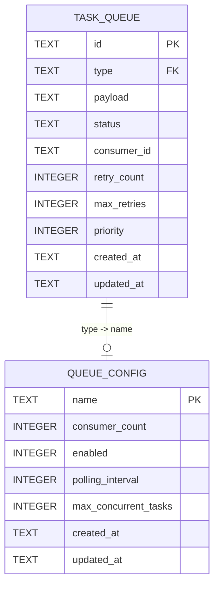
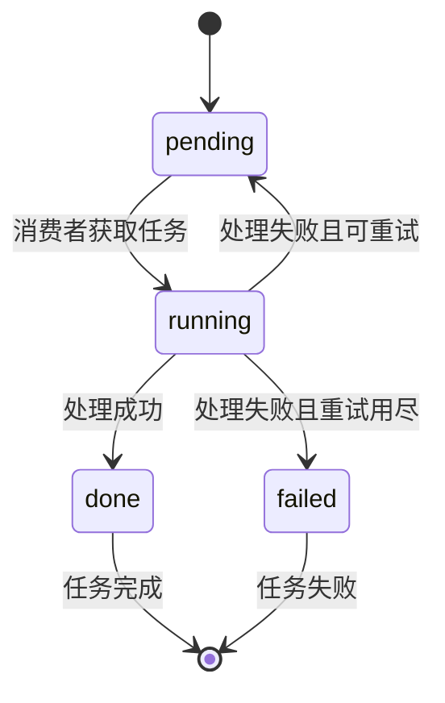

# 多队列多消费者架构 - 数据模型

## 1. 实体定义

### 1.1 任务队列表 (task_queue)

| 字段名 | 类型 | 约束 | 说明 |
|--------|------|------|------|
| id | TEXT | PRIMARY KEY | 任务唯一标识，UUID v4 |
| type | TEXT | NOT NULL | 消息类型/队列名称 |
| payload | TEXT | NOT NULL | 任务参数，JSON 格式 |
| status | TEXT | DEFAULT 'pending' | 任务状态 |
| consumer_id | TEXT | NULL | 当前处理任务的消费者ID |
| retry_count | INTEGER | DEFAULT 0 | 已重试次数 |
| max_retries | INTEGER | DEFAULT 3 | 最大重试次数 |
| priority | INTEGER | DEFAULT 0 | 任务优先级 |
| created_at | TEXT | NOT NULL | 创建时间，ISO 8601 格式 |
| updated_at | TEXT | NOT NULL | 更新时间，ISO 8601 格式 |

**状态枚举**:
- `pending`: 待处理
- `running`: 处理中
- `done`: 已完成
- `failed`: 失败

### 1.2 队列配置表 (queue_config)

| 字段名 | 类型 | 约束 | 说明 |
|--------|------|------|------|
| name | TEXT | PRIMARY KEY | 队列名称（消息类型） |
| consumer_count | INTEGER | DEFAULT 1 | 消费者数量 |
| enabled | INTEGER | DEFAULT 1 | 是否启用 |
| polling_interval | INTEGER | DEFAULT 1000 | 轮询间隔（毫秒） |
| max_concurrent_tasks | INTEGER | DEFAULT 10 | 最大并发任务数 |
| created_at | TEXT | NOT NULL | 创建时间 |
| updated_at | TEXT | NOT NULL | 更新时间 |

---

## 2. 索引设计

### 2.1 任务队列索引

| 索引名 | 字段 | 类型 | 说明 |
|--------|------|------|------|
| idx_task_queue_type_status | type, status | 复合索引 | 加速按类型和状态查询 |
| idx_task_queue_status | status | 单列索引 | 加速状态过滤 |
| idx_task_queue_priority | priority | 单列索引 | 加速优先级排序 |
| idx_task_queue_created_at | created_at | 单列索引 | 加速时间范围查询 |

### 2.2 队列配置索引

| 索引名 | 字段 | 类型 | 说明 |
|--------|------|------|------|
| idx_queue_config_enabled | enabled | 单列索引 | 加速启用状态查询 |

---

## 3. 关系图



---

## 4. 状态转换



---

## 5. DDL 语句

### 5.1 创建任务队列表

```sql
CREATE TABLE IF NOT EXISTS task_queue (
    id TEXT PRIMARY KEY,
    type TEXT NOT NULL,
    payload TEXT NOT NULL,
    status TEXT DEFAULT 'pending',
    consumer_id TEXT,
    retry_count INTEGER DEFAULT 0,
    max_retries INTEGER DEFAULT 3,
    priority INTEGER DEFAULT 0,
    created_at TEXT NOT NULL,
    updated_at TEXT NOT NULL
);

CREATE INDEX IF NOT EXISTS idx_task_queue_type_status ON task_queue(type, status);
CREATE INDEX IF NOT EXISTS idx_task_queue_status ON task_queue(status);
CREATE INDEX IF NOT EXISTS idx_task_queue_priority ON task_queue(priority);
CREATE INDEX IF NOT EXISTS idx_task_queue_created_at ON task_queue(created_at);
```

### 5.2 创建队列配置表

```sql
CREATE TABLE IF NOT EXISTS queue_config (
    name TEXT PRIMARY KEY,
    consumer_count INTEGER DEFAULT 1,
    enabled INTEGER DEFAULT 1,
    polling_interval INTEGER DEFAULT 1000,
    max_concurrent_tasks INTEGER DEFAULT 10,
    created_at TEXT NOT NULL,
    updated_at TEXT NOT NULL
);

CREATE INDEX IF NOT EXISTS idx_queue_config_enabled ON queue_config(enabled);
```

---

## 6. 核心查询

### 6.1 获取待处理任务（带乐观锁）

```sql
UPDATE task_queue
SET status = 'running', 
    consumer_id = :consumer_id,
    updated_at = :now
WHERE id = (
    SELECT id FROM task_queue
    WHERE type = :type 
        AND status = 'pending'
    ORDER BY priority DESC, created_at ASC
    LIMIT 1
)
RETURNING *;
```

### 6.2 统计各队列状态

```sql
SELECT 
    type, 
    status, 
    COUNT(*) as count
FROM task_queue
GROUP BY type, status;
```

### 6.3 获取队列配置

```sql
SELECT * FROM queue_config WHERE enabled = 1;
```

---

## 7. Drizzle ORM 定义

```typescript
import { sqliteTable, text, integer } from 'drizzle-orm/sqlite-core';

export const taskQueue = sqliteTable('task_queue', {
    id: text('id').primaryKey(),
    type: text('type').notNull(),
    payload: text('payload').notNull(),
    status: text('status').default('pending'),
    consumerId: text('consumer_id'),
    retryCount: integer('retry_count').default(0),
    maxRetries: integer('max_retries').default(3),
    priority: integer('priority').default(0),
    createdAt: text('created_at').notNull(),
    updatedAt: text('updated_at').notNull()
});

export const queueConfig = sqliteTable('queue_config', {
    name: text('name').primaryKey(),
    consumerCount: integer('consumer_count').default(1),
    enabled: integer('enabled').default(1),
    pollingInterval: integer('polling_interval').default(1000),
    maxConcurrentTasks: integer('max_concurrent_tasks').default(10),
    createdAt: text('created_at').notNull(),
    updatedAt: text('updated_at').notNull()
});
```
